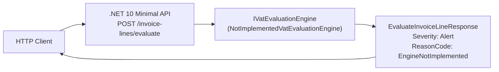
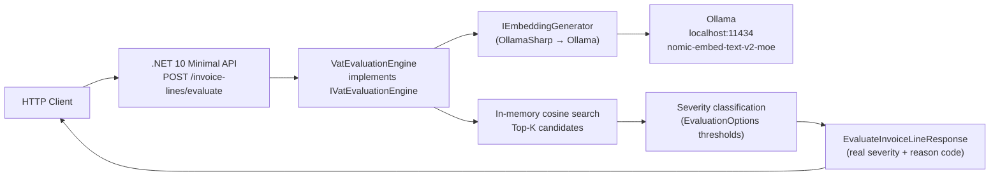
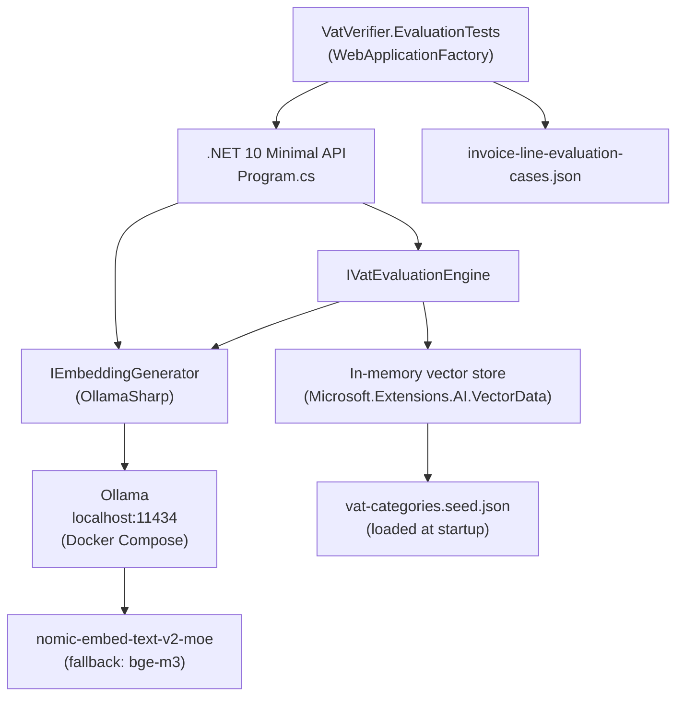
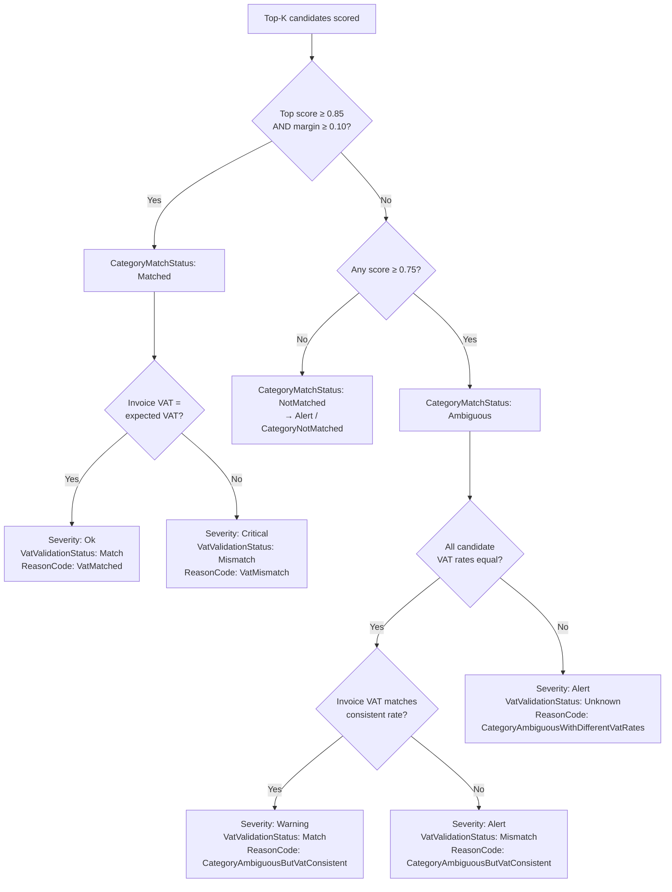

# Architecture Diagrams — Initial Scaffold

## Current state: stub pipeline

The API is wired but the evaluation engine is not implemented. Every request returns `EngineNotImplemented`.

## Intended target state: in-memory embedding pipeline

The intended next step wires a real engine backed by in-memory category embeddings. This is the pipeline the seed data, thresholds, and interface are designed for.

## Component diagram

## Severity decision flow

