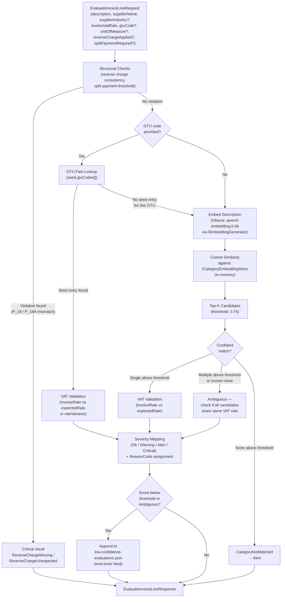
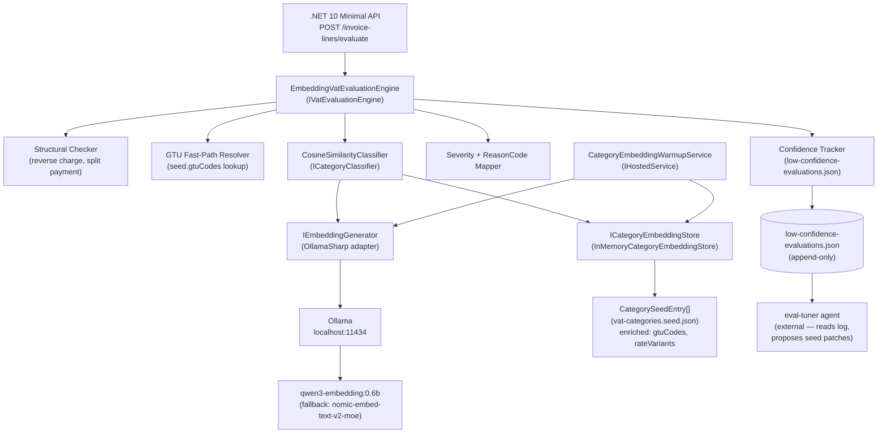
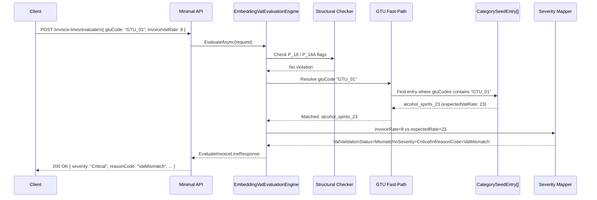

# Architecture Diagrams — KSeF-Aligned Invoice Model

## Classification pipeline flowchart

Shows the evaluation path for a single invoice line. The GTU fast-path short-circuits embedding when a GTU code is present and matches a seed entry. Structural checks run independently of category matching and can produce `Critical` results before embedding is invoked.

## Component diagram

Shows the .NET components, Ollama endpoints, and the confidence log consumed by the eval-tuner agent.

## Sequence diagram — GTU fast-path evaluation

Illustrates the happy path where a GTU code is present, bypassing embedding entirely.

