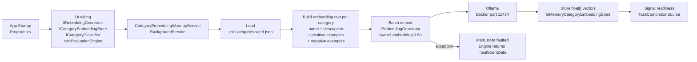
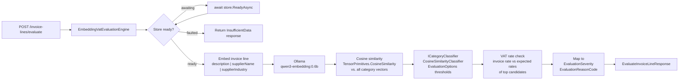
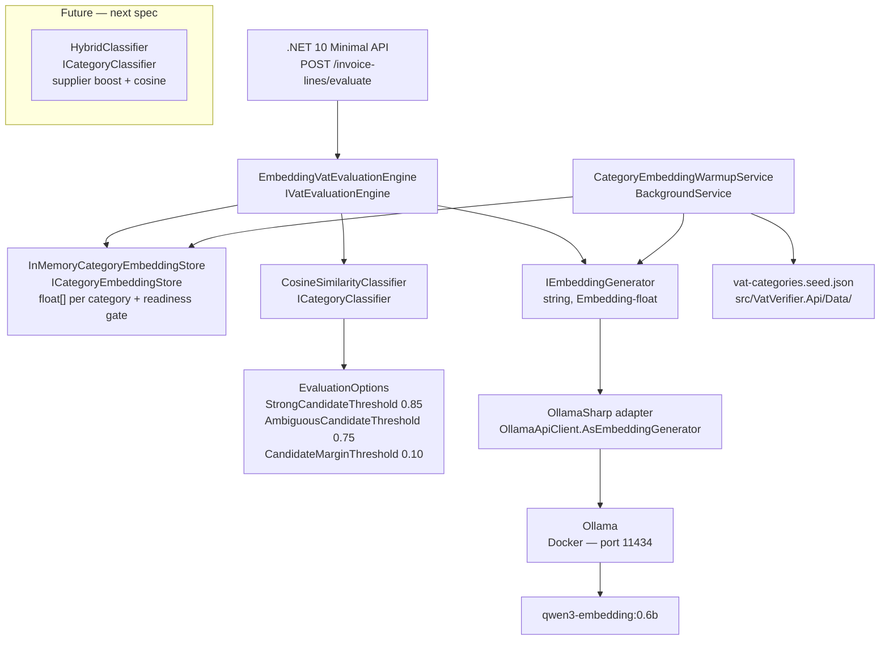

# Architecture Diagrams — In-Memory Embedding Category Classifier

## Startup flow

```mermaid
flowchart LR
    AppStart["App Startup\nProgram.cs"] --> DI["DI wiring\nIEmbeddingGenerator\nICategoryEmbeddingStore\nICategoryClassifier\nIVatEvaluationEngine"]
    DI --> Warmup["CategoryEmbeddingWarmupService\nBackgroundService"]
    Warmup --> LoadJSON["Load\nvat-categories.seed.json"]
    LoadJSON --> BuildText["Build embedding text per category\nname + description\n+ positive examples\n+ negative examples"]
    BuildText --> BatchEmbed["Batch embed\nIEmbeddingGenerator\nqwen3-embedding:0.6b"]
    BatchEmbed --> Ollama["Ollama\nDocker port 11434"]
    Ollama --> StoreVectors["Store float[] vectors\nInMemoryCategoryEmbeddingStore"]
    StoreVectors --> Signal["Signal readiness\nTaskCompletionSource"]
    BatchEmbed -- exception --> Fault["Mark store faulted\nEngine returns InsufficientData"]
```

## Request flow

```mermaid
flowchart LR
    Request["POST /invoice-lines/evaluate"] --> Engine["EmbeddingVatEvaluationEngine"]
    Engine --> Gate{"Store ready?"}
    Gate -- awaiting --> Wait["await store.ReadyAsync"]
    Wait --> Gate
    Gate -- faulted --> Degraded["Return InsufficientData response"]
    Gate -- ready --> EmbedQuery["Embed invoice line\ndescription | supplierName | supplierIndustry"]
    EmbedQuery --> Ollama["Ollama\nqwen3-embedding:0.6b"]
    Ollama --> Cosine["Cosine similarity\nTensorPrimitives.CosineSimilarity\nvs. all category vectors"]
    Cosine --> Classify["ICategoryClassifier\nCosineSimilarityClassifier\nEvaluationOptions thresholds"]
    Classify --> VatCheck["VAT rate check\ninvoice rate vs expected rates\nof top candidates"]
    VatCheck --> Severity["Map to\nEvaluationSeverity\nEvaluationReasonCode"]
    Severity --> Response["EvaluateInvoiceLineResponse"]
```

## Component diagram

```mermaid
graph TD
    API[".NET 10 Minimal API\nPOST /invoice-lines/evaluate"] --> Engine["EmbeddingVatEvaluationEngine\nIVatEvaluationEngine"]

    Engine --> Store["InMemoryCategoryEmbeddingStore\nICategoryEmbeddingStore\nfloat[] per category + readiness gate"]
    Engine --> Classifier["CosineSimilarityClassifier\nICategoryClassifier"]
    Engine --> EmbedGen["IEmbeddingGenerator\nstring, Embedding-float"]

    Classifier --> Options["EvaluationOptions\nStrongCandidateThreshold 0.85\nAmbiguousCandidateThreshold 0.75\nCandidateMarginThreshold 0.10"]

    Warmup["CategoryEmbeddingWarmupService\nBackgroundService"] --> Store
    Warmup --> EmbedGen
    Warmup --> SeedFile["vat-categories.seed.json\nsrc/VatVerifier.Api/Data/"]

    EmbedGen --> OllamaSharp["OllamaSharp adapter\nOllamaApiClient.AsEmbeddingGenerator"]
    OllamaSharp --> Ollama["Ollama\nDocker — port 11434"]
    Ollama --> Model["qwen3-embedding:0.6b"]

    subgraph "Future — next spec"
        HybridClassifier["HybridClassifier\nICategoryClassifier\nsupplier boost + cosine"]
    end
```
