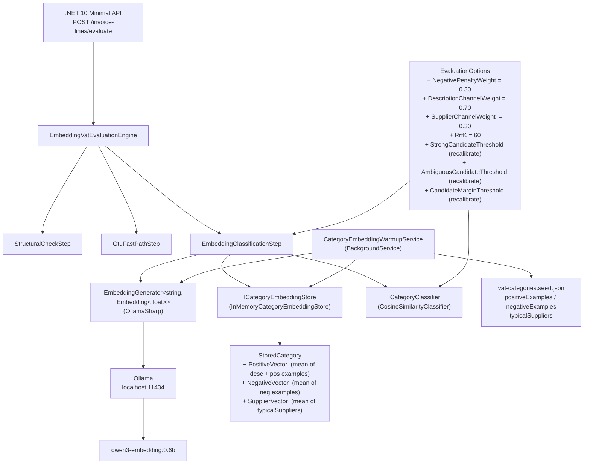

# Architecture Diagrams: Discriminative Embedding Scoring

## Pipeline flowchart

End-to-end flow for a single `POST /invoice-lines/evaluate` request.

```mermaid
flowchart LR
    Request["EvaluateInvoiceLineRequest"] --> Structural["StructuralCheckStep\n(reverse charge / split payment)"]
    Structural -->|"short-circuit on violation"| Response["EvaluateInvoiceLineResponse"]
    Structural -->|"pass"| GTU["GtuFastPathStep\n(exact GTU code lookup)"]
    GTU -->|"short-circuit on GTU match"| Response
    GTU -->|"pass"| Split["Split query signals"]

    Split --> EmbedDesc["Embed Description\nqwen3-embedding:0.6b"]
    Split --> EmbedSupplier["Embed Supplier + Industry\nqwen3-embedding:0.6b"]

    EmbedDesc --> PenaltyScore["pos_sim − α × neg_sim\n(per category, α = 0.30)"]
    PenaltyScore --> RankDesc["Rank by adjusted pos_sim\n(desc_rank)"]

    EmbedSupplier --> SupSim["cosim vs supplier centroid\n(per category)"]
    SupSim --> RankSupplier["Rank by supplier_sim\n(supplier_rank)"]

    RankDesc --> RRF["Weighted RRF Fusion\nw_desc=0.70, w_supplier=0.30, k=60"]
    RankSupplier --> RRF

    RRF --> Classify["CosineSimilarityClassifier\nscores = pos_sim (not wRRF score)\nMatched / Ambiguous / NotMatched"]
    Classify --> Factory["EvaluationResponseFactory\nOk / Warning / Alert / Critical"]
    Factory --> Response
```



## Component diagram

Static components, their relationships, and where the new vector fields live.



## Sequence diagram: single embedding-path request

Shows the two-embedding, two-rank, fuse-then-classify flow for a request that reaches `EmbeddingClassificationStep`.

```mermaid
sequenceDiagram
    participant Client
    participant API as POST /invoice-lines/evaluate
    participant Engine as EmbeddingVatEvaluationEngine
    participant Step as EmbeddingClassificationStep
    participant Ollama as Ollama (qwen3-embedding:0.6b)
    participant Store as InMemoryCategoryEmbeddingStore
    participant Classifier as CosineSimilarityClassifier

    Client->>API: POST {description, supplierName, supplierIndustry, invoiceVatRate}
    API->>Engine: EvaluateAsync(request)
    Engine->>Engine: StructuralCheckStep → pass
    Engine->>Engine: GtuFastPathStep → pass (no GTU)
    Engine->>Step: EvaluateAsync(request)

    Step->>Ollama: GenerateAsync([description])
    Ollama-->>Step: descVector

    Step->>Ollama: GenerateAsync(["supplierName | supplierIndustry"])
    Ollama-->>Step: supplierVector

    Step->>Store: GetAll() → categories[]

    loop per category c
        Step->>Step: pos_sim = cosim(descVector, c.PositiveVector)
        Step->>Step: neg_sim = cosim(descVector, c.NegativeVector)
        Step->>Step: adj_score = pos_sim − 0.30 × neg_sim
        Step->>Step: sup_sim  = cosim(supplierVector, c.SupplierVector)
    end

    Step->>Step: desc_ranked    = sort by adj_score desc
    Step->>Step: supplier_ranked = sort by sup_sim desc
    Step->>Step: wRRF: final_score = 0.70×(1/(60+desc_rank)) + 0.30×(1/(60+sup_rank))
    Step->>Step: candidates = sort by final_score desc; score field = adj_score

    Step->>Classifier: Classify(candidates, request)
    Classifier-->>Step: ClassificationResult (Matched / Ambiguous / NotMatched)
    Step-->>Engine: EvaluateInvoiceLineResponse
    Engine-->>Client: 200 OK
```
