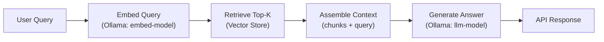
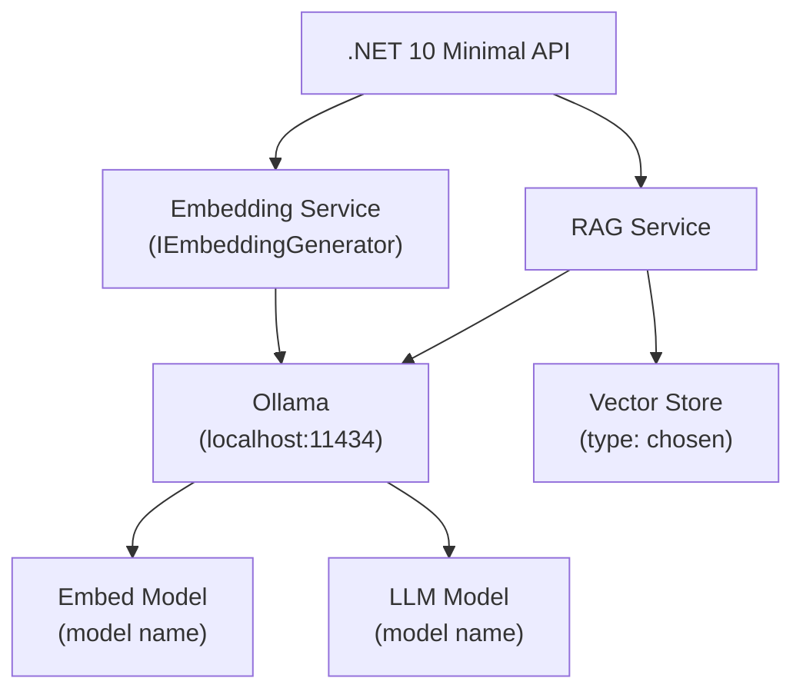

# RAG Specification Writer — Workflow

## Prerequisites

Before Step 1, confirm the load list from `instructions/agents/rag-spec-writer.agent.instructions.md` has been read.

---

## Step 1 — Context intake

Read and internalize:

1. `CLAUDE.md` — note the current scope, established decisions, and explicit deferrals
2. `instructions/project/vat-verifier/rag-context.instructions.md` — note the current stack, hardware constraints, and swap-friendliness requirement
3. Glob `docs/spec/*/` — for each matching directory, extract the two-digit numeric prefix from the directory name (e.g., `01` from `01-init-scaffold`). Next ordinal = highest extracted prefix + 1, zero-padded to at least two digits (e.g., `03`, `10`, `100`). If no directories exist, start at `01`. Do not use the directory count — count-based numbering produces wrong ordinals if any directory was skipped, deleted, or renamed. **After computing, output one visible line: `Next spec ordinal: XX (existing: [list of found prefixes])`** — this is the only way to catch a wrong ordinal before files are written.
4. Read `src/` files selectively only when the user's topic requires understanding the current implementation (e.g., "improve accuracy of current matcher" → read the evaluator code)

**Minimum output:** Internalized project state. No user-visible output required unless a blocking gap is found.

---

## Step 2 — Topic clarification

If `$ARGUMENTS` is empty or too vague to identify a concrete RAG goal, ask:

> "What RAG capability are you looking to spec? For example: add a generation step to the category matcher, build a document Q&A endpoint, improve retrieval accuracy, or add a full ingestion + query pipeline."

Do not proceed to Step 3 until the user has provided a clear goal. One clarification round is sufficient; do not ask follow-up questions unless critical information is still missing.

If the topic is clear from arguments, confirm understanding in one sentence before proceeding:

> "I'll research options for [restated goal]. I'll cover [list of relevant dimensions] and present a comparison for you to decide."

---

## Step 3 — Identify relevant dimensions

Based on the user's goal, select the relevant RAG dimensions from the list below. Not every goal requires all dimensions. Mark each as `covered` or `skip` with a one-line reason.

**Always-relevant dimensions:**
- LLM inference library — abstraction layer for chat completion; determines swap cost
- Embedding model — model + provider for vectorizing text; already partially decided for this project

**Conditionally relevant:**
- Vector store — relevant when the goal involves persistent or scalable retrieval
- Chunking strategy — relevant when the goal involves indexing new content
- RAG pipeline pattern — relevant for any end-to-end generation goal
- Retrieval strategy — relevant when accuracy or diversity of results is in scope
- Context assembly — relevant when prompt design / window management matters
- Reranking — relevant when retrieval quality is the primary concern

State the selected dimensions at the start of Step 4 output so the user can redirect if needed.

---

## Step 4 — Options research

For each selected dimension, enumerate 2–4 concrete options. Apply project constraints as filters before presenting:

**Mandatory filters (discard options that fail these):**
- Free and open-source license
- Compatible with .NET 10 (native package or REST API client)
- Does not require a managed cloud service to function

**Assessment criteria for each option:**

| Criterion | Description |
|:---|:---|
| Ollama integration | Does it natively support Ollama, or does it require a workaround? |
| Swap complexity | How hard is it to replace Ollama with OpenAI or Claude API later? |
| Implementation effort | Relative effort to wire into this project (Low / Medium / High) |
| Testing fit | Is it suitable for a PoC with no database, no auth, no persistent store? |
| Hardware fit | Any constraints for RTX 4070Ti or M3 16GB? (model sizes only) |

Present each dimension as a comparison table, then a brief recommendation anchored to this project's constraints. The recommendation is advisory — the user decides.

**Format per dimension:**

```
### [Dimension name]

| Option | Description | Ollama integration | Swap to OpenAI/Claude | Effort | PoC fit |
|:---|:---|:---|:---|:---|:---|
| ... | ... | Native / Wrapper / None | Easy / Medium / Hard | Low / Medium / High | ✓ / ✗ / ~ |

**Recommended for this project:** [option name] — [one-sentence reason]
**Why not the others:** [brief note per rejected option]
```

---

## Step 5 — Options decision gate (CRITICAL)

After presenting all dimension tables, post the following hard stop:

---

> **Before I write the spec, I need your decisions.**
>
> For each dimension above, tell me which option to use. You can also say "use your recommendation" for any dimension you're happy to defer.
>
> I will not proceed until you've confirmed all dimensions (or explicitly delegated them).

---

This is a hard stop. Do not draft any spec content, diagram, or plan until the user has responded. If the user delegates a dimension ("your call"), record the delegated choice and the reasoning used.

---

## Step 6 — Spec ordinal and slug

Derive from Step 1 context:

- **Ordinal:** taken from the visible `Next spec ordinal: XX` line output in Step 1. If that line is missing, re-run the Glob now — do not guess. Never derive ordinal from directory count.
- **Slug:** kebab-case feature name derived from the user's goal (e.g., `naive-rag-generation`, `category-retrieval-with-reranking`)
- **Spec path:** `docs/spec/<ordinal>-<slug>/`

**Guard:** if ordinal is `01` but the Step 1 Glob returned any existing directories, stop — the ordinal is wrong. Re-read the Glob output, re-extract prefixes, and recompute before writing anything.

State the final path in chat before writing any file: `Writing to: docs/spec/<ordinal>-<slug>/`

---

## Step 7 — Write spec.md

The spec document structure:

```markdown
# [Human-readable feature title]

## Goal

[One paragraph: what this spec achieves, why it matters for this project]

## Constraints

[Bullet list of project constraints that shaped decisions: stack, hardware, free/OSS, testing-only scope]

## Chosen architecture

[One paragraph summary of all decisions made]

### [Dimension 1]: [Chosen option]

[Why this option was chosen. What it provides. What it does not provide.]

### [Dimension N]: [Chosen option]

[...]

## Components

[Bullet list of .NET components, Ollama endpoints, and any Docker services that will be added or modified]

## Alternatives considered

[Brief table of options not chosen, with one-line reason per option]

## Open questions

[Any decisions deferred to implementation, or questions that require prototyping to answer]
```

Keep the spec to the level of a design decision record — what was decided and why, not a detailed implementation guide. The implementation guide lives in `implementation-plan.md`.

---

## Step 8 — Generate architecture diagrams

Produce diagrams in `docs/spec/<ordinal>-<slug>/diagrams/architecture.md` as fenced Mermaid blocks.

**Always include:** RAG pipeline flowchart showing the data flow for a single query.

**Include if the architecture has distinct components or services:** component diagram showing .NET services, Ollama endpoints, and vector store.

**Include if the request/response flow is non-obvious:** sequence diagram for a single end-to-end query.

**Pipeline flowchart template — adapt to chosen options:**



Replace model names and store type with the actual chosen options. Add reranking, query rewriting, or other steps if chosen architecture includes them.

**Component diagram template — adapt to chosen options:**



Label nodes with actual chosen values. Do not use placeholder text in final diagrams.

---

## Step 9 — Write implementation-plan.md

The implementation plan structure:

```markdown
# Implementation Plan: [feature title]

## Prerequisites

[List what must be in place before starting: running Ollama, pulled models, existing packages]

## Steps

### Step 1 — [short title]

**What:** [one sentence description]  
**Files:** [list files to create or modify]  
**Accepts when:** [one measurable acceptance criterion]

### Step N — [short title]

[...]

## Notes

[Anything that warrants a callout: ordering constraints, gotchas, temporary limitations]
```

Sizing: each step should be completable in approximately 1–2 hours. Split steps that feel larger. Do not combine unrelated concerns in one step. Total number of steps should not exceed 10 for a PoC-scale change.

---

## Step 10 — Write artifacts

Write all three files automatically after the user has confirmed decisions in Step 5:

- `docs/spec/<ordinal>-<slug>/spec.md`
- `docs/spec/<ordinal>-<slug>/diagrams/architecture.md`
- `docs/spec/<ordinal>-<slug>/implementation-plan.md`

After writing, state the paths so the user knows where to find the output. If the user gives feedback to revise any artifact, apply changes and overwrite the affected file.

---

## Minimum outputs per invocation

A complete run produces:

1. Options report (in-chat, before gate)
2. `docs/spec/<ordinal>-<slug>/spec.md`
3. `docs/spec/<ordinal>-<slug>/diagrams/architecture.md`
4. `docs/spec/<ordinal>-<slug>/implementation-plan.md`
